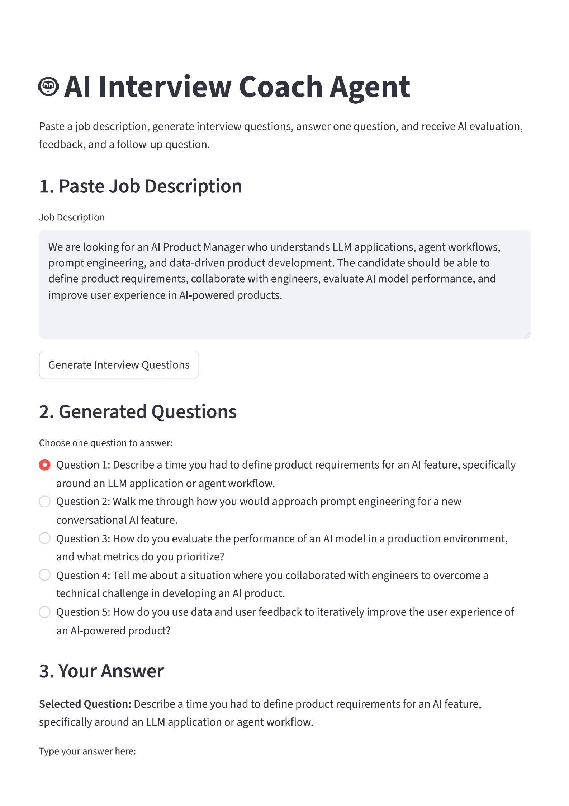
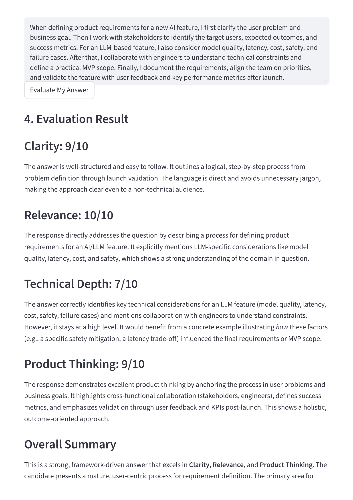
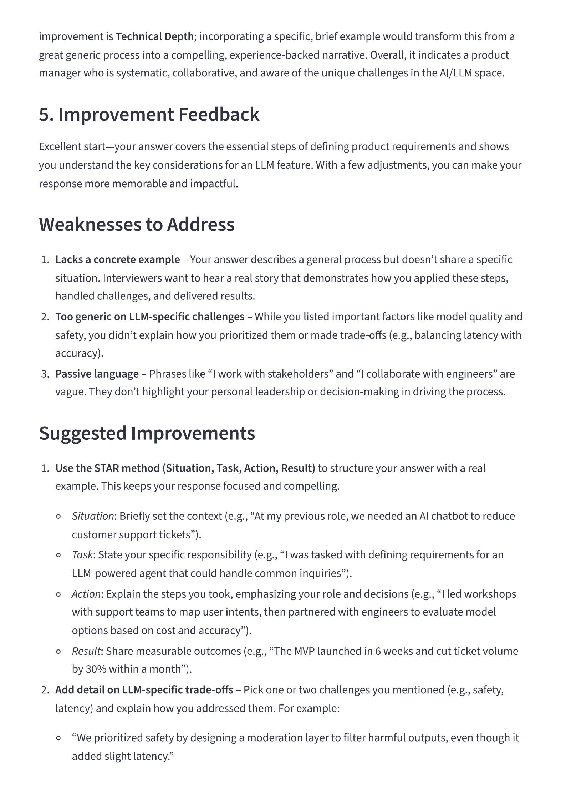
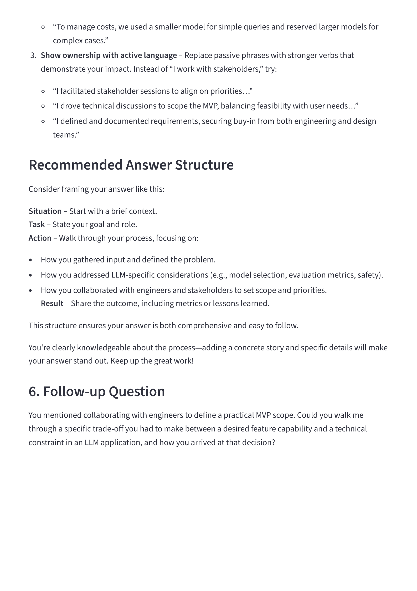

# 🤖 AI Interview Coach Multi-Agent System

An AI-powered mock interview system that generates interview questions from job descriptions and evaluates candidate responses using Large Language Models (LLMs).

The system uses a **multi-agent architecture** where specialized agents collaborate to simulate an interactive interview process, including question generation, answer evaluation, feedback generation, and follow-up questioning.

---

# 🚀 Features

• Generate interview questions automatically from job descriptions  
• Evaluate candidate answers using LLM-based scoring  
• Provide structured improvement feedback  
• Generate follow-up interview questions  
• Interactive web interface built with Streamlit  
• Modular multi-agent architecture  

---

# 🛠 Tech Stack

### Language
- Python

### Framework
- Streamlit

### AI / LLM
- DeepSeek API

### Architecture
- Multi-Agent System
- Agent Orchestration
- Prompt Engineering

---

# 🧠 System Architecture

The system is designed using a **modular multi-agent architecture**, where each agent is responsible for a specific task in the interview workflow.

### Agent Roles

**Question Agent**
- Generates interview questions based on job descriptions.

**Evaluation Agent**
- Evaluates candidate answers across multiple dimensions such as clarity, relevance, and technical depth.

**Feedback Agent**
- Provides actionable improvement suggestions for better interview performance.

**Follow-up Agent**
- Generates deeper follow-up questions based on the user's response.

**Orchestrator Agent**
- Coordinates the workflow between all agents and manages the interview pipeline.

---

# 🖥 Demo

### Generate Interview Questions

### Select Question

### AI Evaluation

### Follow-up Question

---

# 📂 Project Structure

